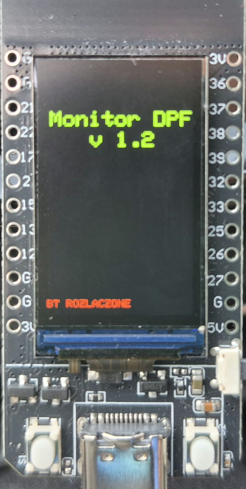
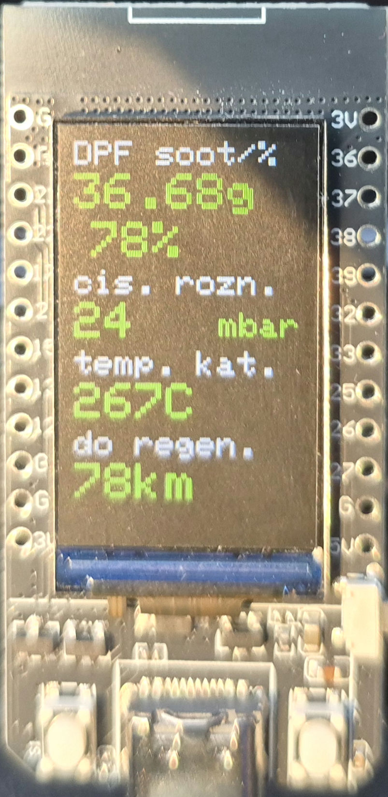
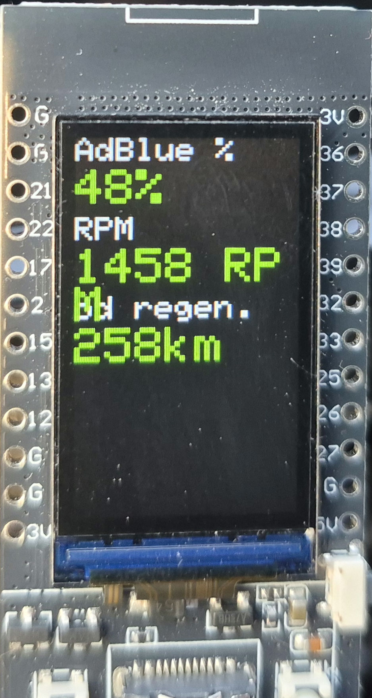
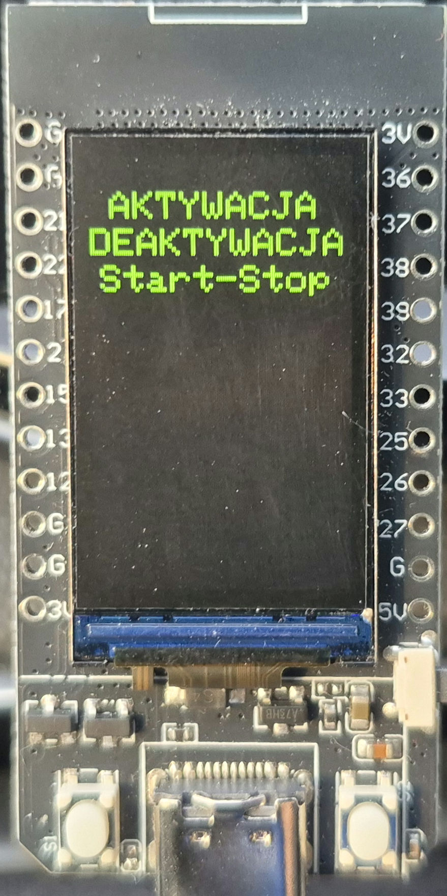
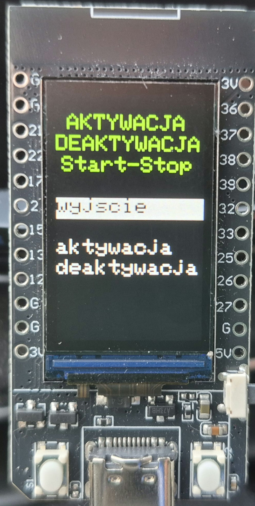
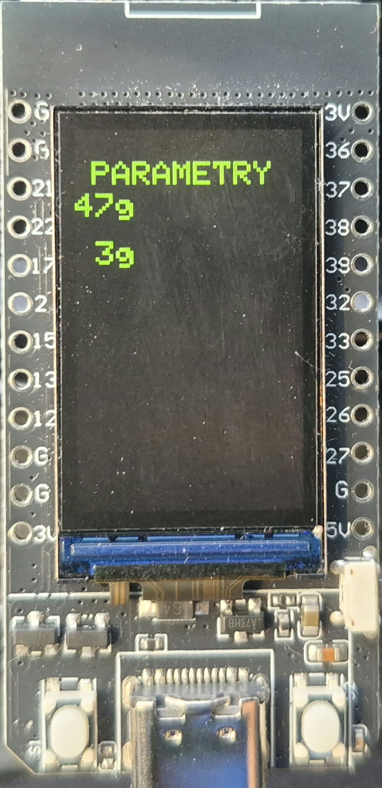
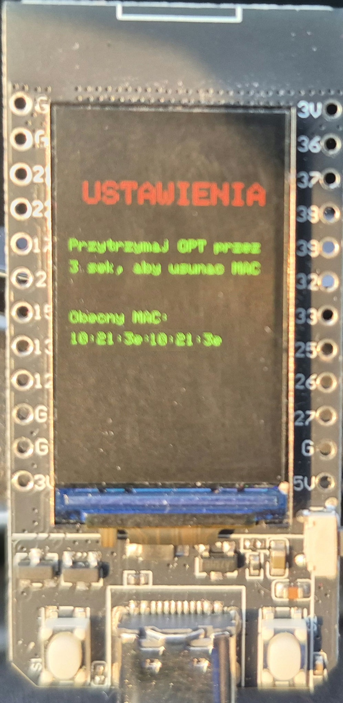

# DPFmonitor

#### Aktualny stan projektu:

Projekt jest w stanie rozwojowym.
Obecnie działają ekrany 1, 2, 3. Ekran 4 wymaga zrobienia bo parametry są na sztywno wpisane w program, pasujące do mojego samochodu. 

Urządzenie nie posiada obudowy. Z doświadczenia uważam, że elektronika nie jest jakoś super wrażliwa ale potencjalnie wyładowanie elektryczne może je uszkodzić. Tak samo upadek z wysokości większej niż 20cm.

Testowane jak na razie z P5008 2.0 Blue HDI z 2022 roku z suchym DPF.
Powinno działać z każdym samochodem w którym CarScanner jest połączony z 2.0 HDI ECU DCM6.2 i odczytuje następujące parametry:

- Engine RPM
- Reagent Tank Level
- [ECM] DPF differentil pressure
- [ECM] DPF soot
- [ECM] DPF distance since last regen
- Catalyst temperature Bank 1 Sensor 1

#### Potrzebne komponenty i połączenie.

1. Urządzenie DPF Monitor zbudowane na ESP32 z wyświetlaczem OLED.

2. Kabel USB-C do zasilania.

3. Kostka OBD2 Vgate ICar Pro bluetooth

#### Elementy urządzenia

Lewy przycisk - następny ekran/opcja

Prawy przycisk - wybierz

#### Uruchomienie

1. Włożyć interfejs OBD2 do gniazda w samochodzie.
2. Podłączyć zasilanie do urządzenia za pomocą kabla USB.
3. Nacisnąć przycisk aktywowania interfejsu OBD2 jeśli jest w taki przycisk wyposażony.
4. Sparować urządzenie z interfejsem OBD2.

#### Opis funkcji

##### Ekran 1

Ten ekran wyświetla się domyślnie po połączeniu z interfejsem OBD2.
Wyświetla on następujące parametry:
- DPF Soot 
  jest to ilość sadzy w filtrze wyliczona przez komputer samochodu podana w gramach (bezpośredni odczyt) i procentach (wyliczana)
  Ponieważ wypalanie może rozpocząć się przy różnych ilościach sadzy które nie są przewidywalne, wartość procentowa jest liczona od stałej wartości ustawionej w parametrach.
- Ciśnienie różnicowe 
  Ciśnienie różnicowe pomiędzy wejściem i wyjściem filtra. Ciśnienie rośnie zależnie od następujących czynników: ilości sadzy w filtrze, obrotów silnika i obciążenia silnika.
- Temperatura katalizatora 
  Temperatura filtra DPF. Wypalanie wykrywane jest poprzez wzrost temperatury powyżej granicznej wartości.
- Dystans do regeneracji 
  Dystans liczony jako procentowe zapełnienie filtra sadzą i liczby przejechanych kilometrów od ostatniej regeneracji. Ze względu na fakt, że nie wiadomo dokładnie przy jakiej ilości sadzy rozpocznie się wypalanie i ile sadzy zostanie po wypalaniu, obliczenia przyjmują pewne założone progi co oznacza, że wyliczony dystans jest tylko orientacyjny. Dodatkowo zmienia się on w zależności od szybkości przyrastania ilości sadzy.

 

##### Ekran 2 

Na ekran drugi można przejść z pierwszego naciskając lewy przycisk.

- Poziom AdBlue 
  Poziom AdBlue odczytany z komputera samochodu. Nie wiem jak dokładny jest ten wskaźnik. U mnie pokazuje ok. 30% gdy na desce wyświetla że AdBlue wystarczy na mniej niż 2500km. Po dolaniu 10L, pokazywał 100% przez jakiś czas zanim zaczęło spadać.
- Obroty silnika 
  Obroty silnika są odczytywane w celu blokady konfiguracji stop-start. Chwilowo są tu umieszczone do czasu gdy zastąpią je inne parametry.
- Dystans od regeneracji 
  Jest to rzeczywisty dystans od ostatniej regeneracji odczytany na bierząco z komputera samochodu.

##### Ekran 3

Ekran 3 umożliwia deaktywowanie i aktywowanie Stop-Start. 
Po wejściu na ten ekran należy wcisnąć prawy przycisk. 

Uwaga: Tą operację należy wykonać przy włączonym zapłonie ale silnik ma pozostać nie uruchomiony.

Opcja nie zadziała jeśli DPF Monitor wykryje, że obroty silnika są wyższe niż 0rpm. 
Po wciśnięciu prawego przycisku pojawi się ekran jak poniżej.

Za pomocą lewego przycisku należy wybrać opcję i następnie aktywować ją prawym. Po wykonaniu operacji DPF Monitor wyświetli potwierdzenie.

Uwaga 1: Przy deaktywowanym Stop-Start na desce cały czas świeci się ikona wyłączonego systemu. W menu samochodu nie można go ponownie włączyć. 
Uwaga 2: Przy ponownym aktywowaniu opcji Stop-Start, na desce rozdzielczej ciągle świeci ikona wyłączonego systemu. Należy wejść do menu samochodu i włączyć go ręcznie.

##### Ekran 4

parametry pracy Monitora

Nie ukończone
(opis do uzupełnienia)

##### Ekran 5

Ekran pokazujący MAC adres interfejsu OBD2 lub informację o braku zaprogramowanego intefejsu.

Gdy MAC jescze nie jest skonfigurowany DPF Monitor szuka urządzeń Bluetooth o nazwach VLINK lub OBDII. Gdy znajdzie takie urządzenie automatycznie zapisuje jego MAC i od tej pory po uruchomieniu próbuje się łączyć tylko z nim.
(opis do uzupełnienia)
